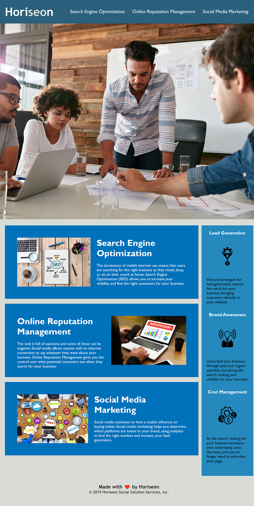

# new-horiesons

In order to meet the accesibilty gudelines, "alt" tags were added to all images as well as a Title that tells what the site is.
A title was given to the background image that was embedded through css.

Semantic HTML elements were added and/or changed to hopefully provide a clean hierarchy of tags.

Under the "main" tag, section that was missing an "id" tag was given one so that it could be indiviually adressed in the css.

The css was rearranged to follow the same hiearchy as the html to make comparing the two easier and sensical.

Many sections in the css that were redundant and using the same codes repeated multiple times were combined into single sections in order to declutter the code.

<b>Link to deployed app:</b>

<b>Site Preview:</b>

